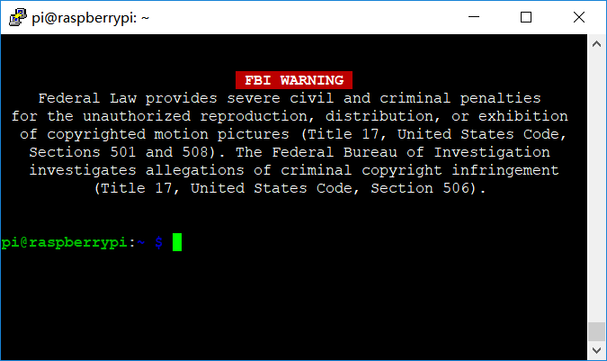
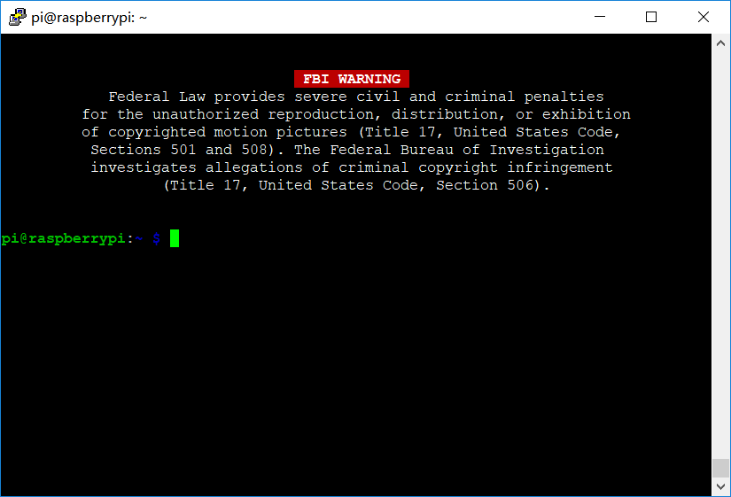
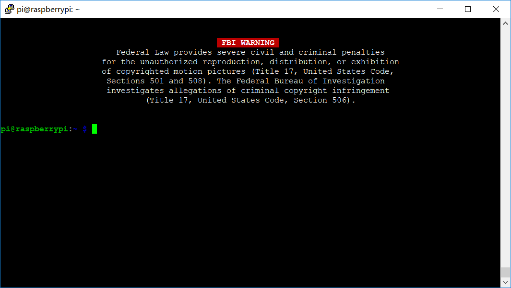
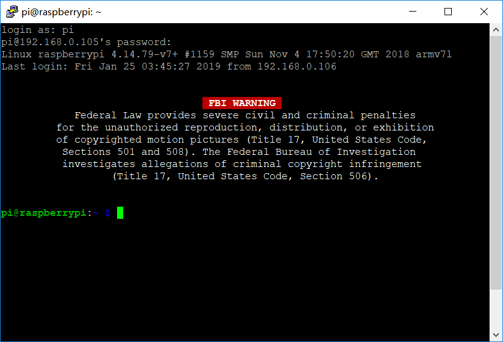

# Responsive-FBI-Warning
A responsive FBI warning for the terminal
# Usage
Configure your terminal startup file such that fbi_warning.sh is run at every login.
For example, add the following lines to `~/.profile` :

`source fbi_warning.sh`

The script will manipulate the terminal using ANSI commands to draw a responsive motd regardless of the instantaneous size of your terminal. Note that your terminal width should be adequate enough to accommodate the text lines; however, any contents and the related typesetting can be freely altered via source code.
# Preview
The following preview shows the output across multiple terminal sizes.

W=65:

W=80:

W=104:

***
Note that the script will draw over your terminal; however, any content on the previous screen will be preserved in the scroll buffer. This is a nice feature by design. See the screenshot below.

